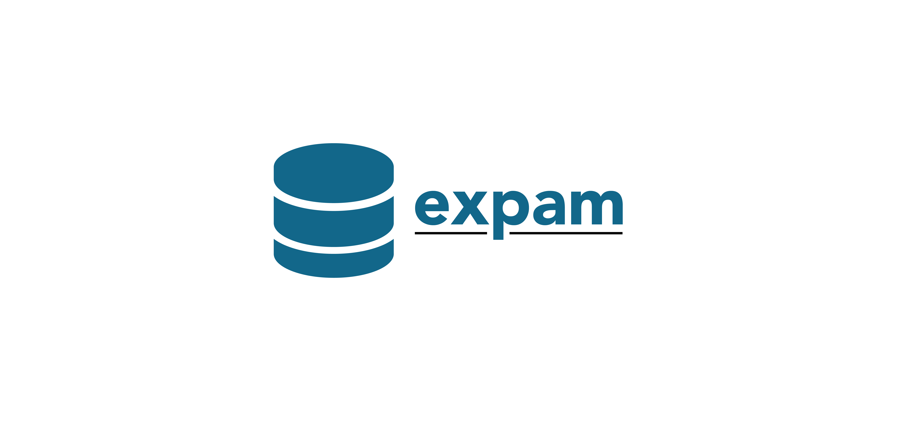

.. expam documentation master file, created by
   sphinx-quickstart on Thu Feb 24 09:37:07 2022.
   You can adapt this file completely to your liking, but it should at least
   contain the root `toctree` directive.

Welcome to the **expam** documentation!
=======================================

.. rst-class:: page-break

**expam** is a Python package for phylogenetic analysis of metagenomic data.

.. include:: .special.rst

.. container:: flexcontainer

   .. container:: colone

      :ref:`Installation Instructions`

   .. container:: coltwo

      :doc:`Quickstart <quickstart>`

   .. container:: colthree

      :doc:`Tutorials <tutorials/index>`

   .. container:: colfour

      .. raw:: html

         

            <a class="reference internal" href="https://github.com/seansolari/expam" target="_blank">GitHub</a>
         

   .. container:: colfive

      .. raw:: html

         

            <a class="reference internal" href="https://doi.org/10.26180/19653840" target="_blank">Database</a>
         

   .. container:: colsix

      .. raw:: html

         

            <a class="reference internal" href="https://github.com/seansolari/expam/issues" target="_blank">Report Bug</a>
         

.. _Installation Instructions:

Installation
------------

It is highly recommended that you use a virtual environment (venv, conda, etc.) when installing and executing expam, so as 
to isolate its dependencies from the rest of your system.

See the :doc:`dependencies <dependencies>` tutorial for more detailed instructions for creating
a virtual environment and managing expam's code and dependencies.

To confirm an installation, you can run 

.. code-block:: console

   $ expam --version
   $ expam --help

Conda
^^^^^
Conda installation is recommended, and best practise is to install *expam* in a new environment. Some users may wish to use the ETE3 toolkit for plotting, while others may prefer the iTOL tool. Both commands are included in respective order.

**With ETE3**

.. code-block:: console

   $ conda create -n expam -c conda-forge -c bioconda -c etetoolkit expam ete3

**Without ETE3**

.. code-block:: console

   $ conda create -n expam -c conda-forge -c bioconda expam

Python Package Index (pip)
^^^^^^^^^^^^^^^^^^^^^^^^^^

**Mac**

You will need a local installation of HDF5. This may already be installed on your machine, but can be installed using Homebrew with the following commands.

.. code-block:: console

   $ brew install pkg-config
   $ brew install hdf5

If you encounter any errors, check the FAQ section on GitHub for solutions.

Then **upgrade pip** and install expam.

.. code-block:: console

   $ python3 -m pip install --upgrade pip
   $ python3 -m pip install expam

**Linux**

You may need to update *g++* resources on your local machine.

.. code-block:: console

   $ apt update
   $ apt-get install build-essential

Then install from PyPi.

.. code-block:: console

   $ python3 -m pip install --upgrade pip
   $ python3 -m pip install expam

From GitHub source
^^^^^^^^^^^^^^^^^^

To install from source, you need a local installation of Python >=3.8, as well as *numpy* and *cython*.
There are some commonly encountered problems when installing on Linux, the most common of which are
outlined in the FAQ section on the `GitHub page <https://github.com/seansolari/expam>`_.

You may need to update *g++* resources on your local machine. For linux, you can run the following.

.. code-block:: console

   $ apt update
   $ apt-get install build-essential

First download the source code from the GitLab repository.

.. code-block:: console

   $ git clone https://github.com/seansolari/expam.git

This can then be installed locally by executing the following command from the source code root.

.. code-block:: console

   $ cd expam
   $ python3 -m pip install --upgrade pip
   $ python3 -m pip install -r requirements.txt
   $ python3 setup.py install

Usage
-----

expam's CLI uses the same structure for all commands and operations:

.. code-block:: console

   $ expam [command] [args...]

For a comprehensive list of commands and arguments, see :doc:`commands <commands>`. Practical usage
of these commands for building and classifying are given in the :doc:`tutorials <tutorials/index>`.

**Important** - monitoring memory usage
---------------------------------------

Be aware of the built-in tools for monitoring and restricting **expam**'s memory usage,
outlined :ref:`here <limiting resource usage>`.

.. toctree::
   :maxdepth: 2
   :caption: Contents:

   quickstart
   Documentation<commands>
   dependencies
   tutorials/index
   tree

Indices and tables
==================

* :ref:`genindex`
* :ref:`modindex`
* :ref:`search`
