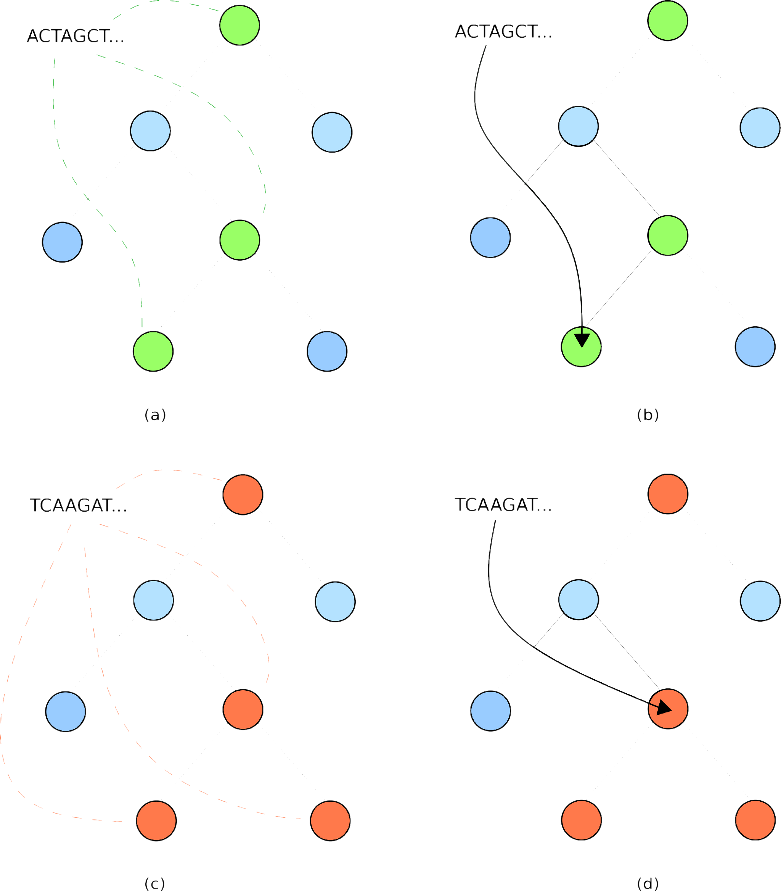

Classifying metagenomic samples
===============================

The classification algorithm
----------------------------

* There are three classes of results:
  
  1. confident classifications,
  2. *split* classifications,
  3. reads that are not like anything currently in the database.

* Consider some metagenomic read. From this read, we can extract the corresponding k-mers.

.. note:: 

    The k-mers of a string are the set of substrings of length k.

    For example, the 5-mers of :code:`ACGTACG` are :code:`ACGTA`, :code:`CGTAC` and :code:`GTACG`.

* We can map the k-mers of metagenomic reads using the **expam** database, which k-mers are mapped to the *lowest common ancestor* of all reference sequences containing this k-mer.
* Due to this mapping, the k-mer distribution of any chunk of sequence from some reference genome should lie along a single lineage in the reference tree.

.. note:: 

  The k-mer distribution of a sequence corresponds to the set of points in the reference tree
  that k-mers from the sequence got mapped to.

* If the k-mer distribution lies along a single lineage, this corresponds to a *confident* classification.

  * In this case, the read is assigned to the lowest point of the k-mer distribution.
  * *See Figures (a) and (b) below.*

* If the k-mers diverge along multiple lineages, there are two possible explanations:

  1. the sequence has come from a genome that is not in the reference database,
  2. a sequencing error has occurred in the form of a base indel/substitution.

* In this case, the read is assigned to the lowest point where the lineages agree.
* *See Figures (c) and (d) below, and note the pressence of two lineages.*

.. note:: 

  Splits can be induced in a read due to sequencing error, which may make some read of a reference genome
  appear as though it does not below to the genome, as a small number of k-mers from this read will be 
  impacted by the incorrect base. m
  
  To overcome this, **expam** implements an :math:`\alpha` parameter, to only consider lineages containing more than :math:`\alpha`\% 
  of the k-mer distribution. This should ignore those lineages in the k-mer distribution that contain
  too few k-mers and are most likely due to sequencing error.

What do I do with splits?
^^^^^^^^^^^^^^^^^^^^^^^^^

.. raw:: html

  
    
"..those that are interested only in a general profile can feel comfortable simply adding classification and split counts together to produce an overall profile."

  

* As we mentioned above, splits can occur either as a result of sequencing error, or due to novel sequence.
* **expam** implements two strategies to deal with splits as a result of sequencing error:
  
    * The :math:`\alpha` parameter ignores lineages in a split distribution with low k-mer representation. *(See the note above.)*
    * There are two cutoff flags that can be supplied, which filter out low abundance clades/taxa from the results. *These are outlined in the following note.*

.. note:: 

  Sequencing errors can produce spurious classifications that manifest as low abundance clades/taxa in the summary files. These should
  be filtered out before interpreting the prevalence of clades and species in your sample.

  The :code:`--cutoff` flag sets a minimum count that any clade/taxa needs to reach before it is included in the classification results.
  The :code:`--cpm` flag sets the same cutoff, but in **count per million** as opposed to a flat cutoff number.

  When both are supplied, :code:`--cpm` takes precedence, and by default **expam** requires each node to have at least
  100 counts per million input reads.

* With both these mechanisms in place, we can be more confident that high split counts in a particular region of the phylogeny is suggestive of novel sequence in the biological sample.
* The algorithm for classifying splits takes a conservative approach - **those that are interested only in a general profile can feel comfortable simply adding classification and split counts together to produce an overall profile.**
* *Splits* can also be used as a marker for genome discovery however - samples reported with a high split counts are potential targets for culturing novel isolates, a useful tool for groups culturing capability.

Phylogenetic classification results
-----------------------------------

* Say we have just run a sample :code:`sample_one.fq` against the database, and the classification results are in a folder :code:`./sample_one`.

  .. code-block:: console

    $ expam run -db my_database -d /path/to/sample_one.fq --name sample_one

* In :code:`./sample_one`, there will be a :code:`phy` subdirectory containing three files:

  * :code:`./sample_one/phy/sample_one.csv` - sample summary file.
  * :code:`./sample_one/phy/classified_counts.csv` - complete classifications.
  * :code:`./sample_one/phy/split_counts.csv` - split classifications.
  * Within :code:`./sample_one/phy`, there will be a :code:`raw` subdirectory containing the output for each read.

Sample summary files
^^^^^^^^^^^^^^^^^^^^

* Each input sample file gets a corresponding sample summary file.
* Tab-delimited file of all results for the sample, both complete and split.
* There are seven columns:

  1. **Node** - classification point in tree.

  .. note::

    If a node points to some location in the reference tree, it will start with a 'p'. 

    This point can be used as input to the :doc:`programmatic tree interface <../tree>` for further analysis.

  2. **Percent classified (cumulative)** - the percentage of all reads classified at or below this node.
  3. **Total classified (cumulative)** - the raw number of reads classified at or below this node.
  4. **Total classified (raw)** - the total number of reads classified at precisely this point.
  5. **Percent split (cumulative)** - the percentage of all reads classified as a split at or below this point.
  6. **Total split (cumulative)** - the total number of reads classified as a split at or below this point.
  7. **Total split (raw)** - the number of reads classified as a split precisely at this node.

.. warning:: 

  The first row of this file contols only the first four of the above mentioned seven columns. This line 
  represents those that are unclassified - neither classified nor split.

Example
"""""""

.. code-block:: console

  unclassified    0.000000%       0       0                       
  p4      100.000000%     1000    3       0.000000%       0       0
  p5      99.700000%      997     232     0.000000%       0       0
  GCF_000005845.2_ASM584v2_genomic        76.500000%      765     765     0.000000%       0       0

.. note:: 

  By default, only nodes with counts (above the cutoff) will be included in these summaries. To include all nodes,
  add the :code:`--keep-zeros` flag at classification.

Classification files - *classified_counts.csv*
^^^^^^^^^^^^^^^^^^^^^^^^^^^^^^^^^^^^^^^^^^^^^^

* Tab-delimited matrix - cells contain number of reads classified to specific node (row) within any given sample (column).
* This enables phylogenetic comparison of samples.
* These classifications correspond to those reads whose k-mer distribution lies on a single lineage (high quality).

Example
"""""""

.. code-block:: console

                                          GCF_000005845.2_ASM584v2_genomic.gz_2
  unclassified                            0
  GCF_000005845.2_ASM584v2_genomic        765
  p4                                      3
  p5                                      232

Split classification files - *split_counts.csv*
^^^^^^^^^^^^^^^^^^^^^^^^^^^^^^^^^^^^^^^^^^^^^^^

* Tab-delimited matrix with same interpretation as *classified_counts.csv*, only these results are those classifications whose lineage was split.

.. note:: 

  The rows and columns of *classified_counts.csv* and *split_counts.csv* will always line up with eachother.

  This is for convenience - those who simply want an overall phylogenetic profile can add these two matrices together without
  needing to pre-process and align the corresponding rows and columns.

Raw read output
^^^^^^^^^^^^^^^

* Contains the read-wise output for each input sample file.
* Each file is tab-delimited, with five columns:
  
  1. **Classification code** - one of C (classified), S (split) or U (unclassified).
  2. **Read ID** - unique identifier for each read, taken from the header line of each sequence.
  3. **Node** - the phylogenetic node where each read is classified.
  4. **Read length** - length of the read string.
  5. **Classification breakdown** - this formatted string is a space-delimited summary of where the kmers of this read belonged to. For instance, the summary :code:`p4:5 p8:16 p4:198` means that 5 kmers were assigned to node :code:`p4`, 16 kmers were then assigned to node :code:`p8`, and finally another 198 kmers were again assigned to :code:`p4`. These results are reported in order, reading the sequence from left to right.

Taxonomic results
-----------------

* Provided you have run the :code:`download_taxonomy` command (see :ref:`section in Commands documentation <download taxonomy>`), you can convert the above phylogenetic results into the taxonomic setting.
* The following two commands accomplish this task equivalently:

.. code-block:: console

  $ expam run -d /path/to/reads --name example --taxonomy

.. code-block:: console

  $ expam run -d /path/to/reads --name example_one
  $ expam to_taxonomy --name example_one

* Where before the results directory contained only a :code:`phy` subdirectory, it will now also contain a :code:`tax` folder.

Taxonomic sample summaries
^^^^^^^^^^^^^^^^^^^^^^^^^^

* For each sample input file, **expam** will translate a corresponding taxonomic sample summary.
* These are tab-delimited matrices with nine columns:
  1. **Taxon ID** - NCBI taxon id.
  2. **Percent classified (cumulative)** - total percentage of reads in this sample classified at or below this taxon id.
  3. **Total classified (cumulative)** - total number of reads classified at or below this taxon id.
  4. **Classified (raw)** - number of reads classified directly to this taxon id.
  5. **Percent split (cumulative)** - total percentage of reads classified as a split, at or below this taxon id.
  6. **Total split (cumulative)** - total number of reads classified as a split, at or below this taxon id.
  7. **Split (raw)** - number of reads classified as a split directly at this taxon id.
  8. **Rank** - taxonomic rank associated with the taxon id.
  9. **Scientific name (lineage)** - (space-separated) taxonomic lineage associated with this taxon id.

Example
"""""""

.. code-block:: console

                 c_perc  c_cumul c_count s_perc  s_cumul s_count rank           scientific name
  unclassified   0.0%    0       0       0.0%    0       0       0              0
  1              100.0%  1000    0       0.0%    0       0       root    
  131567         100.0%  1000    0       0.0%    0       0       top            cellular organisms
  2              100.0%  1000    0       0.0%    0       0       superkingdom   cellular organisms Bacteria
  1224           100.0%  1000    0       0.0%    0       0       phylum         cellular organisms Bacteria Proteobacteria

.. note:: 
  **expam** only supplies taxonomic versions for sample summary files, it does not create any 
  taxonomic version of the :code:`classified_counts.csv`` or :code:`splits_counts.csv` as in the phylogenetic case.

Taxonomic raw output
^^^^^^^^^^^^^^^^^^^^

* **expam** also translates raw classification outputs for each read into the taxonomic setting.
* This is located in :code:`../run_name/tax/raw`, again with one summary file per sample.
* There are four tab-delimited columns:
  
  1. **Classification Code**
  2. **Read ID** - unique identifier for each read, taken from header lines of the sequence.
  3. **Taxon ID** - NCBI taxon id that this read was assigned to.
  4. **Read length** - length of the read string.

Example
"""""""

.. code-block:: 

  C       R4825323246286034638    543     302
  C       R4280015672552393909    511145  302
  S       R5925738157954038177    511145  302
  C       R3237657389899545456    511145  302
  C       R6111671585932593081    511145  302
  C       R4574482278193488645    511145  302

.. note:: 

  Note the lack of 'p' at the start of values in the third column - these refer to NCBI taxonomic IDs,
  not points in the reference tree.
 