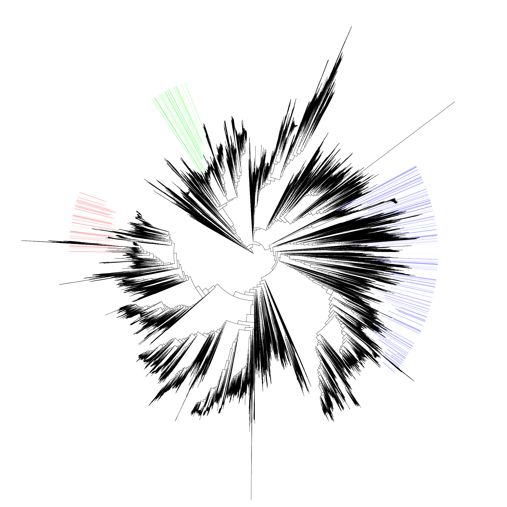

Graphical output
================

* When a :code:`classify` or :code:`to_taxonomy` command is executed, raw summary files are produced (as described in :doc:`Classification <classify>`) and a phylotree is also produced as a graphical depiction of the sample summary.
* This graphical representation has some customisable features:
  
  * Multiple samples can be plotted on the same tree, with different colours for different samples.
  * Sample results can be grouped together to appear as one on the tree.

* Shown below is an example graphical output.
* If no colours are supplied (*see below*), a random colour is chosen for each sample.
* Colours are shaded based on how prevalent any given clade is.

    **Figure 1:** Example phylotree.

* One tree is produced for each type of results - *complete* classifications and *splits*.

Features and CLI
---------------------------

.. raw:: html

    

.. role:: redbackground

:redbackground:`Sample names in the following refer to the original input file without any sequence or compression file extensions.`

For instance, :code:`sample_one.fq.tar.gz` :math:`\rightarrow` :code:`sample_one`.

.. raw:: html

    

.. _groups explanation:

Groups
^^^^^^

.. option:: --group <hex_colour (optional)> <sample_one> <sample_two> ...

    Group together classifications in samples :code:`sample_one`, :code:`sample_two` and so on. **This is done both in
    sample summary files, and on the ouptut phylotree.**

    Optionally, a hex colour string can be supplied just after the :code:`--group` flag to assign a colour to this group.

.. warning:: 

    When specifying a colour for each group, this should be enclosed in quotation marks. Otherwise, the command line
    will treat the rest of the command as a comment (and be ignored).

Example of grouping
"""""""""""""""""""

* Say we have six samples to be profiled and grouped - :code:`a1`, :code:`a2`, :code:`a3`, :code:`b1`, :code:`b2`, :code:`b3`.

.. code-block:: console

    $ expam classify ... --group a1 a2 a3 --group b1 b2 b3
    $ expam classify ... --group "#FF0000" a1 a2 a3 --group "#00FF00" b1 b2 b3

.. note:: 

    In the sample summary files, the combined groups will be referred to by the first member specified in the group (without file extensions).

.. note:: 
    On paired-end data.

    When grouping paired-end data, **only refer to the alphabetically smaller sample name when declaring group members**. 

    Say we are grouping 
    
      * :code:`a1_f.fq`, :code:`a1_r.fq`, :code:`a2_f.fq`, :code:`a2_r.fq`,
      * :code:`b1_f.fq`, :code:`b1_r.fq`, :code:`b2_f.fq`, :code:`b2_r.fq`.

    We could do so through

    .. code-block:: console

        $ expam classify ... --paired --group a1_f a2_f --group b1_f b2_f

Visual flags
^^^^^^^^^^^^

.. option:: --phyla

    Colour the perimeter of the tree with colours associated with the four main bacterial phyla 
    (Actinobacteria, Bacteroidetes, Firmicutes, Proteobacteria).

.. option:: --ignore_names

    Do not add reference genome names to the perimeter of the phylotree.

.. option:: --colour_list

    Instead of randomly assigning colours to each sample, you can supply a list of colours, which will be taken in the supplied order.

    .. note::

        If both :code:`--colour_list` and a colour declared with the group are supplied, the colour declared next to :code:`--group`
        is given priority.

Example of colour list
""""""""""""""""""""""

.. code-block:: console

    $ expam classify ... --colour_list "#FF0000" "#00FF00" "#0000FF"

.. _itol integration:

iTOL integration
----------------

Rather than use :code:`ete3` for visualising classification results, supplying the 
:code:`--itol` flag will instead create a :code:`itol` subdirectory within the output
folder containing two files:

* :code:`tree.nwk` - Newick format tree that can be inserted into iTOL.
* :code:`style.txt` - An iTOL formatted text document that contains all the information needed for iTOL to style the tree.

For instance, say we previously ran :code:`expam classify --out my_run -d /some/samples`, and 
now run :code:`expam phylotree --out my_run --itol`, the corresponding files
would be located at

* :code:`my_run/itol_classified/tree.nwk`,
* :code:`my_run/itol_classified/style.txt`,
* :code:`my_run/itol_splits/tree.nwk`,
* :code:`my_run/itol_splits/style.txt`.

To use these files,

* Create a new tree in iTOL with :code:`tree.nwk`.
* Open this tree using the iTOL interface.
* Drag-and-drop the style.txt into the open tree interface, and iTOL will colour the tree accordingly.

.. note::

    By default, iTOL will only colour the leaf labels and clades with the supplied
    colours. Using the *Colored ranges* window that appears after dragging the style
    sheet onto the tree, you can select the *Cover --> Clade* option for more
    effective highlighting of the distributions.

An example is shown below.

    **Figure 2:** Example tree containing three different sample classification results
    plotted in red, green and blue shades respectively.

    
