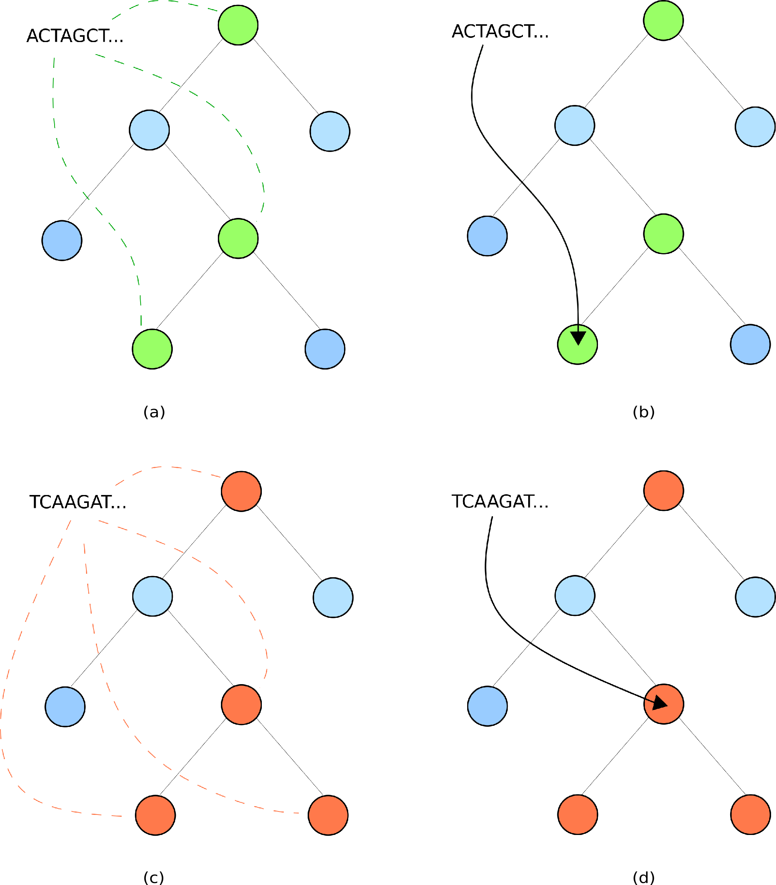

# 2. Classifying metagenomic samples.

## Explaining the classification results
When any samples are classified by expam, reads from these samples are sorted into three different classes;
1. those that can be confidently classified within the database, 
2. those that likely don't belong to something in the database but have some similar relative,
3. those that are not like anything currently in the database. 

Recall that the expam database
consists of some collection of reference sequences, some tree that specifies the 
relationship between these sequences, and a key-value store with keys being kmers and values
being the lowest common ancestor of all genomes in the tree wherein this kmer is observed.

Consider some metagenomic read, and its corresponding kmers. If this read belongs to a
sequence in the database, then all the kmers from this read must lie along a single lineage
in the tree. 

If all kmers from a read line along a single path, then the read is assigned to the lowest
point along this path. This process is shown in Figures *(a)* and *(b)* below, and 
corresponds to case (1) above.

If the kmers from a read diverge along multiple different lineages, then the read is
assigned to the lowest common point of all these lineages. These types of classifications
are referred to as *splits*. This process is shown in Figures
*(c)* and *(d)* below, and corresponds to case (2) above. This lowest common point 
corresponds to a best estimate of where some hypothetical genome containing this read
should belong.

The final case (3) occurs when no kmers from a read have been observed in the database, and 
as such we have no reference point to establish some classification guess.



### What am I supposed to do with splits?
As we just mentioned, there are three classes that reads are separated into: classified, 
split or unclassified. **What am I supposed to do with splits, how is this useful
for my analysis?**

We are aware of two main reasons why splits occur: a read has been taken from a sequence
that is not in the database, or another likely alternative is that we encounter a read 
error which generates spurious kmers that appear to not be in the database, when they in 
fact might be. This latter case tends to result in reads classified at nodes with very
low abundance - one remedy is to choose a sufficiently large cutoff so that these 
low-abundance assignments are ignored. **By default, expam requires 100 counts per million
reads in a sample to be added to the sample summary file**. This can be modified using the
`--cutoff` (raw cutoff count) or `--cpm` (counts per million cutoff) flags.

With a sufficiently large cutoff then, we can suspect that regions in the phylogeny
with a high number of split classifications may be *missing* some genome that the reads
being assigned to this area belong to. In this way, high split classification counts
may be an indicator of novelty in your sample, and so these split classifications can
be used as a tool for genome discovery, with an estimate on what clade of the tree such a
novel genome is likely similar to. 

This may not be your interest however, you may simply be looking for a taxonomic profile
of your sample. In this case, you have two options. One option is to only consider the 
complete classifications and ignore the splits. The second option is to add together the
split and classified counts. This first option represents the more conservative approach,
and will yield a consistently more precise profile than the second method, at the expense
of potentially missing some diversity. The second approach is more liberal, in general 
being less specific but likely capturing more diversity than the first approach. Depending
on your investigation aims, either of these may be suitable, but in our testing we have
found the second (liberal) method to still be highly accurate.

### Explanation of (phylogenetic) results files
<hr>

*This is specifically an explanation of the classification results that are reported
with respect to the phylogeny. As you may be aware, expam has the capacity to translate
these results from any given tree into the taxonomic framework. A discussion of the 
taxonomic results is deferred to the proceeding sections; we currently deal specifically
with phylogenetic results.*

<hr>

Say for instance we run some file `sample_one.fq` against an expam database, using a command
that looks something like
```bash
> expam run -db my_database -d /path/to/sample_one.fq --name sample_one
```
In the corresponding `sample_one` results folder, there will then be the `phy` subdirectory,
containing the classification results of this sample. There will be three files:
1. `sample_one.csv` - the sample summary file.
2. `classified_counts.csv` - a summary of where confident classifications occurred,
3. `splits_counts.csv` - a summary of where split classifications occurred. 

#### Sample summary files

The sample summary file is a tab-delimited summary of all classification results for the 
reads contained in `sample_one.fq`, both confident and split. The seven columns in this 
file are as follows:
1. **Node** - the point in the tree where the classification occurred. *One can recognise
this points to a location in the tree when the number is prepended by a 'p', standing
   for phylogeny.*
2. **Percent classified (cumulative)** - the percentage of all reads classified at or below
this node.
3. **Total classified (cumulative)** - the raw number of reads classified at or below this 
node.
4. **Total classified (raw)** - the total number of reads classified at precisely this point.
5. **Percent split (cumulative)** - the percentage of all reads classified as a split
at or below this point.
6. **Total split (cumulative)** - the total number of reads classified as a split at or below
this point.
7. **Total split (raw)** - the number of reads classified as a split precisely at this node.

If one were to run multiple samples at once, a sample summary file would be created for 
each sample. 

**Note** - the first row of this file does not contain seven columns, only the first four
of those mentioned above. This line represents the reads that are unclassified,
and so are neither classified nor split.

An example is shown below. 

```
unclassified    0.000000%       0       0                       
p4      100.000000%     1000    3       0.000000%       0       0
p5      99.700000%      997     232     0.000000%       0       0
GCF_000005845.2_ASM584v2_genomic        76.500000%      765     765     0.000000%       0       0
```

#### Classification summary file - classified_counts.csv
`classified_counts.csv` is a tab-delimited file, where each column represents a different
sample, and the rows correspond to different nodes within the tree. *Again note that if a 
node is prepended with 'p', it corresponds to a node within the phylogeny*. 

This file therefore consists of a matrix, where cells contain the number of reads 
confidently assigned to a specific node (row) within any given sample (column). This
file therefore enables a phylogenetic comparison of different samples. 

An example of results for a single sample are shown below.

```
                                        GCF_000005845.2_ASM584v2_genomic.gz_2
unclassified                            0
GCF_000005845.2_ASM584v2_genomic        765
p4                                      3
p5                                      232
```

#### Splits summary file - splits_counts.csv
`splits_counts.csv` is also a tab-delimited file, each column again representing a different
sample and rows representing different phylogenetic nodes (note they are prepended with a
'p'). Each element of this matrix is the number of reads classified as a split, to the 
corresponding node (row) in the corresponding sample (column).

<hr>

**Note** - the rows of both `classified_counts.csv` and `splits_counts.csv`
files line up with each other. This is done out of convenience: it was mentioned above
that one may wish to add together the classified and split results, and this way
one can simply add together the values in each matrix without a second thought 
as to aligning different rows and columns. 

<hr>

#### Raw read output
You may also wish to know the classification of each read individually. These individual
results are contained in the `raw` subdirectory of the `phy` results folder (the `phy`
directory is where you would find the above summary files). Each sample has its own 
raw summary, contained in the `raw` subdirectory.

Each file is tab-delimited, with five columns:
1. **Classification code** - one of C (classified), S (split) or U (unclassified).
2. **Read ID** - a unique identifier for each read, taken from the header line of each 
sequence.
3. **Node** - the phylogenetic node where each read is classified. 
4. **Read length** - length of the read string.
5. **Classification breakdown** - this formatted string is a space-delimited summary
of where the kmers of this read belonged to. For instance, the summary
   ```
   p4:5 p8:16 p4:198 
   ```
   means that 5 kmers were assigned to node `p4`, 16 kmers were then assigned
to node `p8`, and finally another 198 kmers were again assigned to `p4`. These results
   are reported in order, reading the sequence from left to right.


## Phylogenetic and taxonomic results
#### Convert results to taxonomy
By default, classification results are only reported with respect to the tree used for 
building the database. This means that reads were assigned to points in the tree. Using the 
taxonomy of each reference sequence, classifications (and splits) within the 
tree can be assigned some to corresponding taxonomic clade. 

During a database build, **expam** collects the Accession ID of each sequence. The
`download_taxonomy` command then searches this accession id against the NCBI database
to automatically find the most up-to-date taxonomic information for each sequence. Moreover,
it only downloads the information for sequences being used in the current database, meaning
that this data takes up very little disk space.

```bash
> expam download_taxonomy -db my_database
```

Depending on the number of sequences being used, this may take a couple of minutes. 

**Important Note**: an alternative is to explicitly specify the Taxon ID for each of your
reference sequences. This can be done by adding `|taxid|NCBI_TAXID` to the header line of any
reference sequence for which you want to specify the taxonomy. **expam** will then use this
instead of trying to search against its accession id. 

<hr> 

One can supply the `--taxonomy` flag during an `expam run` to convert phylogenetic 
results to taxonomic results. Alternatively, if you already have some phylogenetic
classifications, you can supply the name of the classification run to an `to_taxonomy`
command, which will convert the phylogenetic results to taxonomy.

For instance,
```bash
> expam run -d /path/to/reads --name example_one --taxonomy
```
which is roughly equivalent to
```bash
> expam run -d /path/to/reads --name example_one
> expam to_taxonomy --name example_one
```

Where before the `results` directory within the database folder contained only the `phy`
subdirectory, it will now also contain a `tax` subdirectory with taxonomic summary files.

#### Taxonomic summary files
For each phylogenetic sample summary file mentioned above, expam will create a corresponding 
taxonomic summary file. This means that there is one taxonomic summary file for each sample.
These taxonomic summary files are tab-delimited, with a total of 9 columns:
1. **Taxon ID** - NCBI taxon id.
2. **Percent classified (cumulative)** - total percentage of reads in this sample classified
   at or below this taxon id.
3. **Total classified (cumulative)** - total number of reads classified at or below this taxon id.
4. **Classified (raw)** - number of reads classified directly to this taxon id.
5. **Percent split (cumulative)** - total percentage of reads classified as a split, at 
   or below this taxon id.
6. **Total split (cumulative)** - total number of reads classified as a split, at or below
   this taxon id.
7. **Split (raw)** - number of reads classified as a split directly at this taxon id.
8. **Rank** - taxonomic rank associated with the taxon id.
9. **Scientific name (lineage)** - (space-separated) taxonomic lineage associated with
this taxon id.
   
An example of this output is shown below.
```
               c_perc  c_cumul c_count s_perc  s_cumul s_count rank           scientific name
unclassified   0.0%    0       0       0.0%    0       0       0              0
1              100.0%  1000    0       0.0%    0       0       root    
131567         100.0%  1000    0       0.0%    0       0       top            cellular organisms
2              100.0%  1000    0       0.0%    0       0       superkingdom   cellular organisms Bacteria
1224           100.0%  1000    0       0.0%    0       0       phylum         cellular organisms Bacteria Proteobacteria
```

**Note** - expam only supplies taxonomic versions for sample summary files, it does not
create any taxonomic version of the `classified_counts.csv` or `splits_counts.csv` as 
in the phylogenetic case. 

#### Taxonomic raw output files
**expam** also translates the raw classification outputs for each read into the taxonomic
setting. Within the `tax` results subdirectory, there will be a `raw` folder (as there
was in the `phy` results subdirectory) again with one summary file per sample. Each of these
summary files is tab-delimited with 4 columns:
1. **Classification Code**
2. **Read ID** - unique identifier for each read, taken from header lines of the sequence.
3. **Taxon ID** - NCBI taxon id that this read was assigned to.
4. **Read length** - length of the read string.

An example is shown below.
```
C       R4825323246286034638    543     302
C       R4280015672552393909    511145  302
S       R5925738157954038177    511145  302
C       R3237657389899545456    511145  302
C       R6111671585932593081    511145  302
C       R4574482278193488645    511145  302
```

## Additional flags for results
#### --keep_zeros
Instead of only keeping the subset of nodes in the tree where classifications/splits have
been assigned, output all nodes of the tree to the sample summary files. 

```bash
> expam run -d ... --keep_zeros
```
