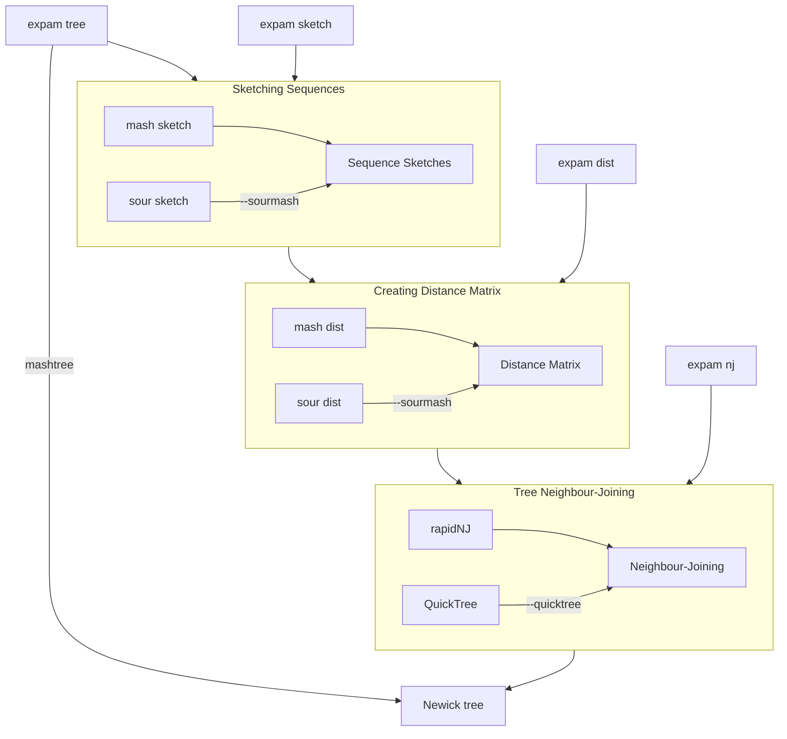

# 3.0 Tree building overview



# 3.1 Building a tree

**Preamble**: Instructions for installing all required software can be found in 
[Tutorial Zero](../0_setup/README.md).

Two routes to build a distance tree:
1. Mashtree,
2. Manually.

Mashtree is a program that automates the process that would otherwise be used in the 
'manual' method. The manual method involves first sketching the sequences, using these
sketches to estimate their distance, and then using the neighbour-joining algorithm to 
create a tree based on these distances.

## Basic tree building
```bash
> expam add -d ~/Documents/Sequences/all/
```

```bash
> expam set -k 31 -n 4 -s 100
```

### Using mashtree
```bash
> expam mashtree
```

```bash
> expam tree
```

### All-in-one Pipeline
The tree-building pipeline is composed of three steps:

1. Sketch sequences.
2. Pairwise distances.
3. Neighbour-joining.

These steps can be completed all at once using the `expam tree` command. 
```bash
> expam tree
```

*Note this `tree` command can be run at any stage, for example above it is run after the 
`mashtree` command. It will simply complete the pipeline at whatever stage the build
is currently at.*

Alternatively, these three steps can be done *manually*.

### Manual Build (mash)

#### Sketch Sequences
```bash
> expam sketch
```

```bash
> ls basic/phylogeny/sketch/
default.k31.s100.msh
```

#### Create distance matrix
```bash
> expam distance
```
```bash
> ls basic/phylogeny/distance/
default.k31.s100.tab

> head -n 3 basic/phylogeny/distance/default.k31.s100.tab
6
GCF_000006765.1_ASM676v1_genomic.fna.gz	0	1	1	1	1	1
GCF_000005845.2_ASM584v2_genomic.fna.gz	1	0	1	1	0.0158863	1
```

#### Run neighbour-joining on distance matrix
Uses a local installation of RapidNJ.
```bash
> expam nj
```

One can instead use a local installation of QuickTree.
```bash
> expam nj --quicktree
```

#### Set tree in database
```bash
> expam tree
```

We can now see that running `expam sketch`, `expam distance`, `expam nj` is equivalent
to one `expam mashtree` (this is the process that is automated by mashtree).

### Manual Build (sourmash)

The above process uses **mash** to sketch the sequences and estimate their distance. 
Another option is to use **sourmash**, which is a Python package and so does not require
a local installation of **mash**. (Note that **sourmash** is installed alongside **expam**).

The two steps relying on **mash** are `sketch` and `distance`. We can instead sketch the
sequences using **sourmash**,
```bash
> expam sketch --sourmash
```

```bash
> expam distance --sourmash
```

**Important** - Either use mash for both sketch and distance, or sourmash for both sketch and,
mash and sourmash should not be mixed between these stages. 

# 3.2 Building a tree in parts

Two groups of sequences, **a** and **b**. 
```bash
> expam add --group a -d ~/Documents/Sequences/genomes/a/
> expam add --group b -d ~/Documents/Sequences/genomes/b/
```

We will assume that it is best to use parameters `k=31, s=1000` (`k` is k-mer size, `s`
is sketch size) to compare the sequences in group **a**, but it is better to use `k=21, s=100`
to compare the sequences in group **b**. We can set these parameters for tree-building.
```bash
> expam set --group a -k 31 -s 1000
> expam set --group b -k 21 -s 100
```

These are just the parameters used by mash for estimating the distances between sequences,
so that we can construct a tree. These parameter values are entirely separate from those
used to construct expam's database. The database build parameters are set in the usual way.
```bash
> expam set -k 31 -n 4
```

**Note:** If you add sequences to specific groups without specifying different `k` or `s`
parameters for each group, values are taken from the database parameters (ie. those
supplied without the `--group` flag, as above).

Prepare the tree template. There are only two things you need to satisfy for this template:
1. It is a Newick file that specifies the phylogenetic relationship between each group.
Groups are clades, and group names must be contained within `{{group_name}}` double braces.
2. The template file must be placed at `../phylogeny/tree/DB_NAME.nwk`, which is the 
`phylogeny` subfolder of the database, and `DB_NAME` is replaced with the name of your
   database.
   
This example is a simple template joining the two groups **a** and **b** at the root. 
```bash
> echo "({{a}},{{b}});" > phylogeny/tree/tree.nwk
```


## Build with mashtree

In [Tutorial One](../1_basic/README.md), we used the `expam mashtree` command to use mashtree
to build a tree for one group of sequences. We have now split the sequences into two groups.
If we supply the `expam mashtree` command now, **expam** will run mashtree on these two
groups of sequences separately.
```bash
> expam mashtree
```
Again run the `tree` command to finalise the tree in the database, using the template to 
combine groups in the tree.
```bash
> expam tree
```
**Alternative**: We can explicitly run mashtree on each group by hand.
```bash
> expam mashtree --group a
> expam mashtree --group b
```
These two commands in succession are equivalent to running `expam mashtree` above.


## Manual build
Despite having split the sequences into groups, supplying the same chain of `sketch`, 
`distance` and `nj` commands will result in expam running these commands on each group
consecutively.


#### Sketching the sequences in each group
We first sketch the sequences.
```bash
> expam sketch
```
which is equivalent to
```bash
> expam sketch --group a
> expam sketch --group b
```
We can check these two groups have been sketched.
```bash
> ls -l database/phylogeny/sketch/
a.k31.s1000.msh
b.k21.s100.msh
```
As above, one can supply the `--sourmash` flag to use **sourmash** instead of **mash**.

#### Pairwise comparisons in each group
We can now get pairwise distances. **These are now only calculated between members of each
group**.

```bash
> expam distance
```
which is equivalent to
```bash
> expam distance --group a
> expam distance --group b
```
The distances can be found in the `../database/phylogeny/distance/` folder.
```bash
> head -n 3 database/phylogeny/distance/a.k31.s1000.tab 
3
GCF_000005845.2_ASM584v2_genomic.fna.gz	0	0.0172634	1
GCF_000006925.2_ASM692v2_genomic.fna.gz	0.0172634	0	1
```

*Again, if `--sourmash` was used to create sketches, this flag should again be used
when calculating distances.*

#### Applying neighbour-joining
Neighbour-joining is then run on each group consecutively, to create each sub-tree.
```bash
> expam nj
```
which is equivalent to
```bash
> expam nj --group a
> expam nj --group b
```

#### Finalise tree.
Each subtree is then combined according to the template specified above, which recall is
```
({{a}}, {{b}});
```
simply the two subtrees attached at the root.
```bash
> expam tree
```
Recall the `--quicktree` flag can be used, if QuickTree is preferred to RapidNJ.
