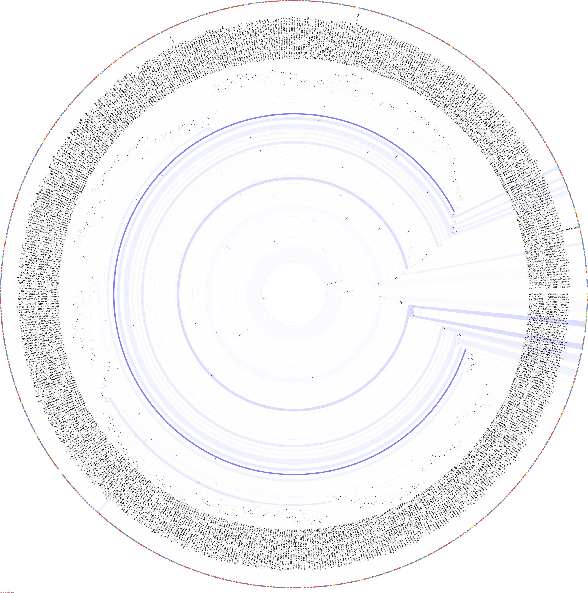

# 4. Visual depiction of results

When a `run` or `to_taxonomy` command is executed, the resulting classifications are not only
summarised through the documents described in [Tutorial 2](./../2_classify), they
are also graphically depicted on the tree used to build the database.
This gives a visual representation for the phylogenetic diversity 
in any given sample/collection of samples.

This graphical representation is customisable:
- Multiple samples can be plotted on the same tree, with different colours for
different samples.
- Samples that are grouped together will also appear as one on the tree.

Shown below is an example graphical representation that expam provides
of the classification results for a sample. If no colours are supplied (see below), a
random colour is chosen for each sample, and each clade of the tree is shaded with this
colour based on how many classifications occur within this area. 

#### Graphical representation of splits
Splits are also graphically depicted for each sample, however instead of shading the clades,
they are graphically depicted as shaded red dots at the root of the clade, where the
intensity of the shade shows how many splits have occurred at any given point. 



## Grouping of samples

If one is running a collection of samples, it may be desirable to group the results of 
some subset of samples together on the phylotree. 

Say for example we have six samples `a1, a2, a3, b1, b2, b3` that are to be
profiled and plotted on the phylotree. We can group samples `a` together and samples `b`
together using the following command.
```bash
> expam run ... --group a1 a2 a3 --group b1 b2 b3 
```
You can specify as many members in any group as you want, and samples should be referred to
by the file name, without any file extensions (fa, fq, gz, etc.).

In the classification summary files, these grouped samples will be referred to by the first 
declared group member in the command (here `a1` and `b1`). 

You can assign colours to each group simply by prepending the list of group members
with a hexadecimal colour.

Taking the previous example, we have samples `a1, a2, a3, b1, b2, b3` where
we want to combine these into groups `a = {a1, a2, a3}` and `b = {b1, b2, b3}`. Say 
in the phylotree we want to plot the results of `a` in blue and `b` in red. 

```bash
> expam run ... --group "#0000FF" a1 a2 a3 --group "#FF0000" b1 b2 b3
```

**Note**: hexadecimal colours must be enclosed in quotation marks, otherwise the shell
will treat it as a comment.

#### Remark on paired-end data
When grouping paired-end data, only refer to the alphabetically smaller file name when
declaring group members.

For instance, with samples `a1_f.fq, a1_r.fq, a2_f.fq, a2_r.fq, b1_f.fq, b1_r.fq,
b2_f.fq, b2_r.fq` and grouping samples `a` and `b` separately, we would use the following
group flags
```
--group a1_f a2_f --group b1_f b2_f
```

## Additional Flags

#### --phyla
Supplying the `--phyla` flag colours the perimeter of the tree with colours associated
with the four main bacterial phyla (Actinobacteria, Bacteroidetes, Firmicutes, 
Proteobacteria). 

#### --ignore_names
Do not add reference genome names to the perimeter of the phylotree.

#### --colour_list
Instead of randomly assigning a colour to each sample, you can supply a list of 
hexadecimal colours that will be taken from in order.

```bash
> expam run ... --colour_list "#FF0000" "#00FF00" "#0000FF"
```

#### --circle_scale
Splits are depicted as red circles at the root of each clade where splits have occurred.
What size you would like these circles to be depends on the scale of your phylogenetic tree.
To allow flexibility, the size of these circles can be scaled using the `--circle_scale`
flag with a float value (`1.0` represents normal scale).
```bash
> expam run ... --circle_scale 5.0
```
Or they can be removed altogether by specifying size `0.0`.
```bash
> expam run ... --circle_scale 0.0
```